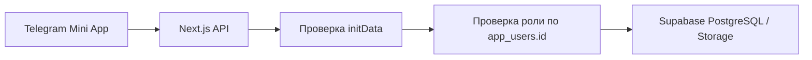

# Техническое задание: RaionCupBot

## 1. Назначение документа

Нужно с нуля реализовать рабочий production-ready MVP Telegram Mini App для проведения одного районного футбольного турнира примерно на 8–10 команд.

Codex должен не ограничиваться макетами интерфейса. Результатом должна стать полностью работающая система:

- Telegram-бот с командой `/start` и кнопкой открытия Mini App;
- Telegram Mini App с пользовательскими и административными экранами;
- серверный API;
- полноценная база данных PostgreSQL в Supabase;
- Supabase Storage для логотипов команд;
- проверка подлинности Telegram Mini App `initData`;
- серверная проверка ролей и прав;
- автоматический расчёт таблицы, шахматки и статистики;
- журнал действий;
- SQL-миграции, создающие базу данных целиком;
- инструкции по локальному запуску и развёртыванию на Supabase Free и Vercel Free.

Документ является основным источником требований. Если отдельная техническая деталь не описана, выбрать наиболее простое, безопасное и поддерживаемое решение, которое не расширяет функциональный объём MVP.

---

## 2. Ключевые ограничения

1. Система обслуживает только один конкретный турнир.
2. Не нужно заранее закладывать интерфейс для сезонов, нескольких турниров, дивизионов или кубковых сеток.
3. Формат турнира — общая таблица, один круг, матчи распределены по турам, без плей-офф.
4. Количество команд ориентировочно 8–10.
5. Расписание не генерируется автоматически.
6. Mini App работает только внутри Telegram. Публичная веб-версия без Telegram не нужна.
7. Уведомления о матчах и результатах не нужны.
8. Роли назначаются владельцем проекта вручную через базу данных. Интерфейс управления ролями в MVP не нужен.
9. Все связи с пользователем в базе должны использовать внутренний `app_users.id` типа `uuid`. Нельзя использовать имя, фамилию или Telegram ID как внешний ключ.
10. Проект должен укладываться в бесплатные тарифы Supabase и Vercel.

---

## 3. Референсы и решения из Blossom Bot

В приложенном проекте `blossom-bot-main` следует использовать как референс:

- полноэкранный splash во время инициализации;
- приветствие в зависимости от времени суток;
- сменяющиеся тематические фразы во время загрузки;
- вызовы `Telegram.WebApp.ready()` и `Telegram.WebApp.expand()`;
- передачу подписанного `Telegram.WebApp.initData` на сервер;
- серверную HMAC-проверку `initData`;
- первоначальную загрузку профиля и прав пользователя;
- отображение дополнительной вкладки администрирования только пользователям с правами;
- вывод связанного с профилем логотипа.

Код Blossom Bot не нужно копировать буквально. Его структура для нового проекта не подходит:

- весь сервер не должен находиться в одном большом файле наподобие `app.py`;
- весь интерфейс, стили и JavaScript не должны находиться в одном `index.html`;
- роли нельзя хранить списком Telegram ID в переменных окружения;
- логотипы нельзя связывать с сущностями через имена файлов вида `salon_1.png`;
- production-авторизация не должна принимать `tg_id` из query-параметров;
- бизнес-правила, доступ к данным и представление должны быть разделены.

Новый проект следует сделать модульным на TypeScript.

Сайт `https://ffrme.ru/` используется только как общий референс разделения данных на календарь, таблицу, статистику и карточку матча. Не переносить его сложность, лишние сущности и функции.

---

## 4. Рекомендуемый стек

### 4.1. Приложение

- Next.js с App Router, последняя стабильная версия, совместимая с Vercel;
- React;
- TypeScript в строгом режиме;
- CSS Modules или Tailwind CSS — выбрать один подход и применять последовательно;
- Zod для валидации входных данных;
- официальный Telegram Mini Apps SDK либо небольшой типизированный адаптер над `window.Telegram.WebApp`;
- Supabase JavaScript client только в серверном коде для операций с базой и Storage;
- Vitest для модульных тестов;
- Playwright для ключевых end-to-end сценариев.

### 4.2. Инфраструктура

- Supabase Free:
  - PostgreSQL;
  - Storage;
  - SQL migrations;
- Vercel Free:
  - Next.js frontend;
  - Route Handlers для API;
  - webhook Telegram-бота.

Supabase Auth для пользовательского входа не требуется. Идентичность пользователя определяется только через проверенное Telegram Mini App `initData`.

### 4.3. Архитектурный принцип

Клиент никогда не обращается к таблицам Supabase с привилегированным ключом напрямую.

Поток запроса:



`SUPABASE_SERVICE_ROLE_KEY` должен существовать только на сервере. Он не должен попадать в `NEXT_PUBLIC_*`, клиентский bundle, логи или ответы API.

---

## 5. Предлагаемая структура репозитория

Допускаются небольшие отклонения, но разделение ответственности должно сохраниться.

```text
raion-cup-bot/
├── src/
│   ├── app/
│   │   ├── (miniapp)/
│   │   │   ├── layout.tsx
│   │   │   ├── page.tsx
│   │   │   ├── calendar/
│   │   │   ├── standings/
│   │   │   ├── statistics/
│   │   │   ├── profile/
│   │   │   └── admin/
│   │   └── api/
│   │       ├── bootstrap/route.ts
│   │       ├── me/
│   │       ├── teams/
│   │       ├── matches/
│   │       ├── standings/route.ts
│   │       ├── chessboard/route.ts
│   │       ├── statistics/route.ts
│   │       ├── admin/
│   │       └── telegram/webhook/route.ts
│   ├── components/
│   │   ├── common/
│   │   ├── navigation/
│   │   └── splash/
│   ├── features/
│   │   ├── onboarding/
│   │   ├── calendar/
│   │   ├── matches/
│   │   ├── standings/
│   │   ├── statistics/
│   │   ├── profile/
│   │   └── admin/
│   ├── lib/
│   │   ├── telegram/
│   │   ├── auth/
│   │   ├── permissions/
│   │   ├── supabase/
│   │   ├── validation/
│   │   └── date-time/
│   ├── server/
│   │   ├── repositories/
│   │   ├── services/
│   │   └── mappers/
│   └── types/
│       └── database.generated.ts
├── supabase/
│   ├── migrations/
│   │   └── 0001_initial_schema.sql
│   ├── seed.sql
│   └── README.md
├── tests/
│   ├── unit/
│   ├── integration/
│   └── e2e/
├── public/
│   └── fallback-team-logo.svg
├── .env.example
├── README.md
└── package.json
```

Компоненты не должны выполнять SQL-запросы, проверять роли или содержать расчёт турнирной таблицы. Бизнес-правила размещаются в серверных сервисах и, где нужна атомарность, в PostgreSQL-функциях.

---

## 6. Пользователи, идентификация и роли

### 6.1. Пользователь

При первом валидном открытии Mini App сервер создаёт либо обновляет строку в `app_users`.

Основной идентификатор системы:

```text
app_users.id: uuid
```

Дополнительный уникальный атрибут:

```text
app_users.telegram_id: bigint
```

`telegram_id` нужен для поиска пользователя после проверки `initData`, но другие таблицы должны ссылаться на `app_users.id`.

Для пользователя хранятся:

- внутренний `id`;
- `telegram_id`;
- имя;
- фамилия;
- Telegram username, если есть;
- любимая команда;
- факт завершения первого onboarding;
- дата первого входа;
- дата последнего входа;
- дата создания и изменения записи.

Имя и фамилия обычного пользователя могут первоначально заполняться из подписанных данных Telegram. Имя и фамилия главного администратора, модераторов и администраторов команд должны быть заполнены в базе. Эти значения используются при публичном отображении автора результата.

### 6.2. Роли

Роли:

- `super_admin` — единственный главный администратор;
- `moderator` — модератор результатов;
- `team_admin` — администратор конкретной команды;
- обычный пользователь — пользователь без специальных строк в `user_roles`.

У одного пользователя может быть несколько ролей одновременно. Например, он может быть модератором и администратором команды.

У одной команды может быть несколько администраторов.

Роль хранится отдельной строкой:

| Поле | Назначение |
|---|---|
| `id` | ID назначения роли |
| `user_id` | FK на `app_users.id` |
| `role` | `super_admin`, `moderator` или `team_admin` |
| `team_id` | обязательно только для `team_admin` |
| `created_at` | время назначения |
| `created_by` | внутренний ID пользователя, если назначение выполнено приложением |

Пример назначения вручную:

```sql
select id, telegram_id, first_name, last_name
from public.app_users
where telegram_id = 123456789;

insert into public.user_roles (user_id, role, team_id)
values (
  'UUID_ПОЛЬЗОВАТЕЛЯ',
  'team_admin',
  'UUID_КОМАНДЫ'
);

insert into public.user_roles (user_id, role, team_id)
values (
  'UUID_ПОЛЬЗОВАТЕЛЯ',
  'moderator',
  null
);
```

Нельзя:

- хранить несколько Telegram ID через точку с запятой;
- записывать в `user_roles` имя или фамилию вместо `user_id`;
- определять права только на клиенте;
- доверять роли, переданной клиентом.

### 6.3. Матрица прав

| Действие | Обычный пользователь | Администратор команды | Модератор | Главный администратор |
|---|:---:|:---:|:---:|:---:|
| Просмотр календаря, таблицы, шахматки, статистики | Да | Да | Да | Да |
| Выбор любимой команды | Да | Да | Да | Да |
| Управление игроками своей команды | Нет | Да | Только при наличии `team_admin` | Да |
| Управление игроками других команд | Нет | Нет | Нет | Да |
| Перевод игрока между командами | Нет | Нет | Нет | Да |
| Создание и изменение расписания | Нет | Нет | Нет | Да |
| Создание и публикация результата | Нет | Только при наличии `moderator` | Да | Да |
| Изменение уже опубликованного результата | Нет | Нет | Нет | Да |
| Управление командами | Нет | Нет | Нет | Да |
| Просмотр полного журнала действий | Нет | Нет | Нет | Да |
| Управление ролями через Mini App | Нет | Нет | Нет | Нет |

Если у пользователя несколько ролей, его доступ является объединением разрешений этих ролей.

---

## 7. Первый запуск и приветственный экран

### 7.1. Boot splash

При каждом открытии Mini App немедленно показывается полноэкранный приветственный splash, основанный на логике Blossom Bot.

Splash содержит:

- логотип любимой команды;
- название приложения или турнира;
- приветствие по времени суток;
- имя пользователя;
- короткую тематическую фразу загрузки;
- ненавязчивую анимацию логотипа и индикатор загрузки.

Примеры фраз:

- `Готовим календарь матчей…`
- `Обновляем турнирную таблицу…`
- `Считаем голы и передачи…`
- `Проверяем составы команд…`
- `Расставляем команды по местам…`

Фразы можно менять примерно раз в 1,5 секунды, пока выполняется bootstrap.

Логика:

1. Вызвать `Telegram.WebApp.ready()` и `Telegram.WebApp.expand()`.
2. Взять Telegram-пользователя только для предварительного отображения имени.
3. Отправить `initData` на `/api/bootstrap`.
4. Сервер проверить подпись, найти или создать `app_users`, вернуть профиль, роли, любимую команду и базовые настройки турнира.
5. Если любимая команда есть, показать её логотип и аккуратно использовать её основной цвет.
6. Если команда или её логотип отсутствуют, использовать нейтральный логотип турнира либо `fallback-team-logo.svg`.
7. После успешной загрузки плавно скрыть splash.
8. При ошибке не скрывать экран бесконечно: показать понятное сообщение и кнопку `Повторить`.

Для мгновенного повторного запуска допускается хранить в `localStorage` кэш URL логотипа, короткого названия и основного цвета любимой команды. Кэш должен быть разделён по Telegram ID и использоваться только для отображения. Источником истины остаётся ответ сервера.

### 7.2. Выбор любимой команды

Если `onboarding_completed_at` отсутствует, после splash открыть экран `Выберите любимую команду`.

Экран содержит:

- сетку команд;
- логотип команды либо fallback;
- полное или короткое название;
- населённый пункт;
- визуальное выделение выбранной карточки;
- кнопку `Подтвердить`;
- кнопку `Пропустить` внизу.

Кнопка `Подтвердить` неактивна, пока команда не выбрана.

После подтверждения:

- записать `favorite_team_id`;
- записать `onboarding_completed_at`;
- обновить локальный кэш;
- кратко показать персонализированный welcome-state с логотипом выбранной команды;
- открыть `Календарь`.

После `Пропустить`:

- оставить `favorite_team_id = null`;
- записать `onboarding_completed_at`, чтобы экран не появлялся при каждом запуске;
- открыть `Календарь`.

Любимую команду можно позднее выбрать или изменить в `Профиле`.

---

## 8. Навигация и общие требования к интерфейсу

### 8.1. Нижняя навигация

Для обычного пользователя:

1. `Календарь`
2. `Таблица`
3. `Статистика`
4. `Профиль`

Для пользователя хотя бы с одной специальной ролью добавляется:

5. `Админ-панель`

Внутри `Админ-панели` показываются только действия, разрешённые конкретному пользователю.

Приложение после инициализации по умолчанию открывает `Календарь`. Отдельный главный экран не нужен.

### 8.2. Визуальный стиль

- мобильный интерфейс для Telegram;
- чистый современный спортивный стиль;
- хорошая читаемость таблиц на экранах шириной от 320 px;
- поддержка safe-area Telegram и мобильных устройств;
- корректная работа со светлой и тёмной темами Telegram;
- цвета любимой команды используются как акцент, но не ухудшают контраст;
- выделение должно быть понятно не только по цвету: добавить полосу, маркер или иконку;
- логотипы не растягивать и не обрезать некорректно;
- состояния загрузки, пустых списков, ошибок и повторной попытки обязательны;
- административные формы должны предупреждать о несохранённых изменениях.

---

## 9. Турнирная логика

### 9.1. Формат

- один турнир;
- общая таблица;
- один круг;
- ориентировочно 8–10 команд;
- матчи организованы по номерам туров;
- плей-офф отсутствует;
- дополнительное время и серия пенальти как стадия матча отсутствуют;
- система не генерирует пары, даты и время;
- главный администратор вручную задаёт тур, хозяев, гостей, дату и время;
- система не запрещает повторно создать матч тех же команд и не показывает блокирующую валидацию.

Все завершённые опубликованные матчи, включая повторно заведённые, учитываются в таблице.

### 9.2. Очки

- победа — 3 очка;
- ничья — 1 очко каждой команде;
- поражение — 0 очков.

### 9.3. Столбцы таблицы

Строгий порядок:

```text
Команда | И | В | Н | П | МЗ-МП | РМ | О
```

Где:

- `И` — игры;
- `В` — победы;
- `Н` — ничьи;
- `П` — поражения;
- `МЗ-МП` — забитые и пропущенные мячи через дефис;
- `РМ` — разница мячей;
- `О` — очки.

### 9.4. Распределение мест

Основная сортировка — по очкам по убыванию.

Если одинаковое количество очков имеют ровно две команды:

1. результат личных встреч между ними;
2. общая разница мячей;
3. меньше пропущенных мячей;
4. ручной порядок главного администратора.

Если личная встреча завершилась вничью или отсутствует, сразу перейти к общей разнице мячей.

Если между двумя командами ошибочно создано несколько завершённых матчей, для личного сравнения использовать сумму очков во всех этих встречах.

Если одинаковое количество очков имеют три и более команды:

1. мини-таблицу не строить;
2. личные встречи не применять;
3. использовать общую разницу мячей;
4. затем меньше пропущенных мячей;
5. затем ручной порядок главного администратора.

Если команды равны по всем автоматическим критериям и ручной порядок ещё не задан:

- показать им одинаковое место;
- расположить по названию только для стабильного отображения;
- в админ-панели показать предупреждение `Требуется определить порядок при полном равенстве`.

Главный администратор должен иметь возможность задать последний критерий через поле ручного приоритета. Этот приоритет применяется только после всех автоматических критериев.

---

## 10. Календарь и матчи

### 10.1. Статусы матча

Хранить статус независимо от типа результата:

- `scheduled` — запланирован;
- `rescheduled` — перенесён;
- `completed` — завершён;
- `cancelled` — отменён.

При переносе обновляются дата и время, статус становится `rescheduled`, а старое и новое значения сохраняются в журнале.

После публикации обычного либо технического результата статус становится `completed`.

### 10.2. Календарь

Календарь группируется по турам.

Карточка матча показывает:

- номер тура;
- дату;
- время;
- логотипы и названия обеих команд;
- статус;
- для завершённого матча — счёт или обозначение технического результата.

По умолчанию показываются запланированные и перенесённые матчи.

Переключатель с подписью `Прошедшие матчи` добавляет в список завершённые и отменённые матчи. Выбор можно сохранять локально.

Матчи любимой команды визуально выделяются.

Нажатие на матч открывает его карточку.

### 10.3. Карточка матча

Для незавершённого матча:

- команды;
- дата и время;
- тур;
- текущий статус.

Для завершённого обычного матча:

- команды;
- автоматически рассчитанный счёт;
- протокол в двух колонках: слева события хозяев, справа события гостей;
- автор каждого гола;
- ассистент в скобках, если он указан;
- отметка `пен.` для пенальти;
- отметка `автогол` для автогола;
- информация о том, кто и когда опубликовал результат;
- информация о последнем изменении, если оно было.

Пример публичного блока:

```text
Результат внёс: Иванов Иван
29.07.2026, 18:42

Последнее изменение: Петров Пётр
30.07.2026, 10:15
```

Время хранится в UTC, но отображается в часовом поясе турнира `Europe/Moscow`.

---

## 11. Протокол и ввод результата

### 11.1. Общие правила

Счёт обычного матча вручную не вводится.

Он автоматически равен количеству голевых событий, начисленных каждой команде.

Допускается `0:0`, при котором список событий пуст.

Минуты голов не хранятся и не отображаются.

Не учитываются:

- стартовые составы;
- замены;
- карточки;
- удаления;
- игровые номера;
- лучший игрок;
- длительность таймов;
- количество игроков на поле.

Каждый гол хранится отдельным событием. Это необходимо, потому что у голов одного игрока могут быть разные ассистенты и типы.

### 11.2. Типы голевых событий

#### Обычный гол

- автор выбирается из активной заявки команды, которой начисляется гол;
- ассистент необязателен;
- ассистент выбирается из той же активной заявки;
- автор и ассистент не могут быть одним игроком.

#### Гол с пенальти

- автор выбирается из активной заявки команды;
- ассистент недоступен и всегда равен `null`;
- гол входит в общее число голов игрока;
- отдельно учитывается как гол с пенальти.

#### Автогол

- гол начисляется команде соперника;
- автор автогола выбирается из активной заявки команды, в чьи ворота забит автогол;
- ассистент недоступен;
- событие не увеличивает обычные голы игрока;
- событие увеличивает количество автоголов игрока;
- автогол отображается в карточке игрока и отдельной статистической вкладке.

В записи события необходимо хранить:

- команду, которой начислен мяч;
- команду игрока на момент события;
- ID игрока;
- ID ассистента при наличии;
- тип события;
- порядковый номер для стабильного отображения.

Снимок команды в событии обязателен. После перехода игрока старый протокол и командная статистика не должны изменяться.

### 11.3. Экран ввода результата

Главный администратор или модератор:

1. выбирает матч;
2. добавляет голевые события для хозяев и гостей;
3. видит счёт, который меняется автоматически;
4. при необходимости выбирает технический результат;
5. переходит на обязательный экран проверки;
6. подтверждает публикацию.

До финального подтверждения данные существуют только в редакторе. При закрытии редактора с изменениями показать предупреждение. Отдельные общие черновики результата в базе для MVP не нужны.

На экране проверки показать:

- команды;
- итоговый автоматически рассчитанный счёт;
- все голы;
- ассистентов;
- пенальти;
- автоголы;
- предупреждение модератору: после публикации он не сможет изменить результат.

Публикация результата и всех его событий должна выполняться одной атомарной транзакцией.

### 11.4. Редактирование результата

- модератор может создать и опубликовать результат;
- после публикации модератор не может его изменить;
- опубликованный результат может изменить только главный администратор;
- изменение главным администратором заменяет протокол атомарно;
- счёт и вся статистика пересчитываются автоматически;
- старое и новое состояние целиком записываются в журнал действий;
- публичная карточка показывает автора публикации и автора последнего изменения.

---

## 12. Технические результаты

Тип результата хранится отдельно от статуса матча:

- `normal`;
- `home_technical_loss`;
- `away_technical_loss`;
- `double_technical_loss`.

### 12.1. Одностороннее техническое поражение

Администратор выбирает проигравшую команду.

- проигравшей команде: поражение, 0 очков, мячи `0:3`;
- победившей команде: победа, 3 очка, мячи `3:0`;
- в карточке отображается `3:0 (ТП)` либо `0:3 (ТП)` в зависимости от стороны;
- игрокам не создаются голы и передачи;
- технические мячи учитываются в `МЗ-МП` и `РМ`.

### 12.2. Обоюдное техническое поражение

- обеим командам засчитывается одна игра;
- обеим командам засчитывается поражение;
- обе команды получают 0 очков;
- в строке каждой команды учитываются мячи `0:3`;
- в карточке матча показывается `ТП — ТП` и подпись `Обоюдное техническое поражение`;
- в шахматке с точки зрения каждой команды показывается `0:3 ТП`;
- голевые события и статистика игроков не создаются.

Из-за асимметрии обоюдного ТП нельзя рассчитывать таблицу только из единственной пары `home_score/away_score`. SQL-представление таблицы должно отдельно обрабатывать этот тип результата.

При выборе любого технического результата редактор должен потребовать подтверждение удаления уже добавленных голевых событий.

---

## 13. Команды

Для команды хранятся:

- `id`;
- полное название;
- короткое название;
- населённый пункт;
- путь к логотипу в Supabase Storage, nullable;
- основной цвет в формате `#RRGGBB`;
- признак активности;
- ручной приоритет для полного равенства в таблице, nullable;
- даты создания и изменения;
- внутренние ID авторов создания и последнего изменения.

Требования:

- полное и короткое названия обязательны;
- основной цвет валидируется;
- логотип может отсутствовать;
- неактивная команда остаётся в исторических матчах, но не предлагается при создании нового матча;
- физически удалять команду, участвовавшую в матчах, нельзя;
- главный администратор управляет командами через админ-панель;
- также должна сохраниться возможность редкого ручного редактирования через Supabase.

### 13.1. Storage

Создать bucket `team-logos`.

- чтение логотипов публичное;
- загрузка, замена и удаление выполняются только через сервер после проверки `super_admin`;
- допустимые типы: PNG, JPEG, WebP и SVG;
- максимальный размер файла — 2 МБ;
- имя объекта строится по ID команды, а не по её названию;
- при замене использовать уникальную версию имени или cache-busting;
- путь хранится в `teams.logo_path`, а публичный URL формируется централизованно.

---

## 14. Игроки и заявки команд

### 14.1. Данные игрока

Хранятся только:

- `id`;
- имя;
- фамилия;
- текущая команда;
- признак активности;
- даты создания и изменения;
- автор создания и последнего изменения.

Не нужны:

- отчество;
- дата рождения;
- фотография;
- позиция;
- игровой номер;
- возрастные ограничения.

В одной активной заявке нельзя создать двух игроков с одинаковыми именем и фамилией без учёта регистра и лишних пробелов.

Игроки с одинаковыми именем и фамилией в разных командах допустимы.

### 14.2. Управление заявкой

Администратор команды может:

- просматривать игроков своей команды;
- добавлять игрока;
- исправлять имя и фамилию;
- удалить игрока, если он не используется ни в одном актуальном протоколе;
- убрать из активной заявки игрока, который используется в протоколе.

Изменения применяются сразу, без подтверждения главного администратора, и записываются в журнал.

Главный администратор имеет те же права для всех команд.

Если игрок связан хотя бы с одним текущим голом, ассистом или автоголом:

- hard delete запрещён внешними ключами и серверной логикой;
- действие `Удалить из заявки` устанавливает `is_active = false`;
- неактивный игрок не показывается при вводе новых событий;
- исторический протокол и статистика сохраняются.

Если главный администратор изменил протоколы и больше ни одной ссылки на игрока нет, физическое удаление снова разрешается.

### 14.3. Переход игрока

Переход выполняет только главный администратор.

При переходе:

- обновляется текущая команда игрока;
- создаётся запись истории перехода;
- старая статистика игрока сохраняется;
- старые события сохраняют команду на момент матча;
- общая личная статистика игрока продолжает суммироваться;
- новый игрок с тем же именем и фамилией не создаётся;
- переход запрещён, если в новой команде уже есть активный игрок с теми же именем и фамилией.

---

## 15. Таблица и шахматка

### 15.1. Обычная таблица

- данные рассчитываются только из опубликованных завершённых матчей;
- технические результаты учитываются;
- отменённые, запланированные и перенесённые без результата матчи не учитываются;
- строка любимой команды выделяется основным цветом, боковой полосой и маркером;
- заголовок таблицы остаётся видимым при вертикальном скролле;
- на узких экранах разрешён горизонтальный скролл;
- форматы `МЗ-МП` и `РМ` не разносить на несколько строк.

### 15.2. Шахматка

На экране `Таблица` сделать переключатель:

- `Таблица`;
- `Шахматка`.

Шахматка:

- команды расположены и по строкам, и по столбцам;
- диагональ содержит `—`;
- результат отображается с точки зрения команды в строке;
- будущий матч обозначается датой либо нейтральным маркером;
- технический результат содержит `ТП`;
- любимая команда выделяется одновременно по всей строке и всему столбцу;
- пересечение строки и столбца выделяется сильнее;
- нажатие по ячейке открывает карточку матча.

Если между двумя командами существует несколько матчей, отобразить все результаты в ячейке компактно, в хронологическом порядке. Нажатие открывает список этих матчей.

---

## 16. Статистика

Раздел содержит четыре вкладки:

1. `Бомбардиры`
2. `Ассистенты`
3. `Гол + пас`
4. `Автоголы`

Статистика строится только по опубликованным обычным результатам. Технические мячи игрокам не начисляются.

### 16.1. Бомбардиры

Формат:

```text
9 (1)
```

где:

- `9` — все голы игрока;
- `1` — голы с пенальти.

Сортировка:

1. больше всех голов;
2. больше голов без пенальти;
3. больше ассистов;
4. при полном равенстве — одинаковое место и алфавитный порядок.

### 16.2. Ассистенты

- сортировка по числу ассистов по убыванию;
- при равенстве — одинаковое место;
- фамилии и имена используются только для стабильного алфавитного отображения.

### 16.3. Гол + пас

Формат:

```text
12 (9+3)
```

где:

- `12` — сумма голов и ассистов;
- `9` — голы;
- `3` — ассисты.

Сортировка:

1. сумма `голы + ассисты`;
2. больше голов;
3. больше ассистов;
4. при полном равенстве — одинаковое место и алфавитный порядок.

### 16.4. Автоголы

- сортировка по числу автоголов по убыванию;
- автоголы не входят в обычные голы и `Гол + пас`;
- при равенстве — одинаковое место и алфавитный порядок.

Для равных показателей использовать спортивное ранжирование: например, `1, 1, 3`.

При переходе игрока общая личная статистика сохраняется. В списке показывать его текущую команду, а события в карточках старых матчей продолжают показывать команду на момент матча.

---

## 17. Профиль

Экран `Профиль` содержит:

- имя и фамилию пользователя;
- при необходимости Telegram username;
- список специальных ролей пользователя;
- карточку `Любимая команда`;
- логотип любимой команды;
- полное название;
- населённый пункт;
- кнопку `Изменить`.

Если любимая команда не выбрана:

- показать нейтральное состояние;
- кнопку `Выбрать любимую команду`.

Изменение команды использует тот же компонент выбора, что и onboarding. После сохранения:

- обновляется `favorite_team_id`;
- изменяется выделение в календаре, таблице и шахматке;
- обновляется кэш splash;
- текущий экран не должен требовать полной перезагрузки приложения.

---

## 18. Админ-панель

Админ-панель состоит из доступных пользователю модулей.

### 18.1. Главный администратор

Модули:

- `Расписание`
  - создать матч;
  - изменить тур, команды, дату и время;
  - отметить перенос;
  - отменить матч;
- `Результаты`
  - внести результат;
  - изменить опубликованный результат;
  - назначить обычный или технический тип;
- `Команды`
  - создать и изменить команду;
  - загрузить или заменить логотип;
  - изменить цвет;
  - деактивировать;
  - задать ручной порядок при полном равенстве;
- `Заявки`
  - управлять игроками любой команды;
  - переводить игрока;
- `Журнал`
  - фильтры по пользователю, сущности, действию и периоду;
  - просмотр старых и новых значений.

Управления ролями через UI нет.

### 18.2. Модератор

Модули:

- список матчей без опубликованного результата;
- редактор результата;
- экран проверки;
- публикация.

Опубликованный результат доступен модератору только для просмотра.

### 18.3. Администратор команды

Модули:

- заявка своей команды;
- добавление, редактирование, удаление или деактивация игроков.

Если пользователь администрирует несколько команд, перед работой с заявкой показывается выбор команды.

---

## 19. Telegram-бот

Бот нужен только как точка входа.

При `/start` бот отправляет:

- короткое информационное сообщение о турнире;
- inline-кнопку `Открыть приложение` типа `web_app`.

Уведомления, рассылки, ввод результатов в чате и сложные команды не нужны.

Webhook:

- размещается в Next.js Route Handler;
- принимает только POST;
- проверяет заголовок `X-Telegram-Bot-Api-Secret-Token`;
- не логирует токен и полное содержимое чувствительных данных;
- повторная доставка одного update не должна создавать дубликаты действий.

---

## 20. API

Названия можно немного скорректировать, сохранив назначение и права.

### 20.1. Пользовательские endpoints

| Метод | URL | Назначение |
|---|---|---|
| `POST` | `/api/bootstrap` | Проверка `initData`, upsert пользователя, профиль, роли, настройки, любимая команда |
| `GET` | `/api/teams` | Активные команды |
| `PATCH` | `/api/me/favorite-team` | Выбрать или изменить любимую команду |
| `POST` | `/api/me/onboarding/skip` | Завершить onboarding без выбора |
| `GET` | `/api/matches` | Календарь с фильтрами |
| `GET` | `/api/matches/:id` | Карточка матча |
| `GET` | `/api/standings` | Рассчитанная таблица |
| `GET` | `/api/chessboard` | Данные шахматки |
| `GET` | `/api/statistics?type=scorers` | Статистика нужного типа |
| `GET` | `/api/teams/:id/players` | Публичный состав команды |

### 20.2. Административные endpoints

| Метод | URL | Минимальная роль |
|---|---|---|
| `POST` | `/api/admin/matches` | `super_admin` |
| `PATCH` | `/api/admin/matches/:id` | `super_admin` |
| `POST` | `/api/admin/matches/:id/publish-result` | `moderator` или `super_admin` |
| `PUT` | `/api/admin/matches/:id/result` | только `super_admin` |
| `POST` | `/api/admin/teams` | `super_admin` |
| `PATCH` | `/api/admin/teams/:id` | `super_admin` |
| `POST` | `/api/admin/teams/:id/logo` | `super_admin` |
| `POST` | `/api/admin/teams/:id/players` | `team_admin` этой команды или `super_admin` |
| `PATCH` | `/api/admin/players/:id` | `team_admin` текущей команды или `super_admin` |
| `DELETE` | `/api/admin/players/:id` | `team_admin` текущей команды или `super_admin` |
| `POST` | `/api/admin/players/:id/transfer` | только `super_admin` |
| `GET` | `/api/admin/audit-log` | только `super_admin` |

Все ответы должны иметь единый формат ошибок. Не возвращать клиенту stack trace, SQL-текст, ключи или внутренние сообщения Supabase.

Мутации должны принимать `Idempotency-Key` либо иметь иную защиту от повторной отправки, особенно публикация результата и загрузка логотипа.

---

## 21. Модель базы данных

Codex обязан создать полный SQL, а не только описать таблицы.

Минимальные сущности:

### 21.1. `app_settings`

Одна строка с настройками:

- название турнира;
- часовой пояс;
- путь к нейтральному логотипу;
- основной цвет по умолчанию;
- дата создания и изменения.

Не создавать отдельную многоуровневую модель сезонов и турниров.

### 21.2. `teams`

Поля из раздела «Команды».

### 21.3. `app_users`

Поля из раздела «Пользователи».

`favorite_team_id` ссылается на `teams.id`.

### 21.4. `user_roles`

Роли с обязательным `user_id`.

Ограничения:

- `team_id is not null` только и обязательно для `team_admin`;
- для `super_admin` и `moderator` `team_id is null`;
- одна и та же роль для пользователя и команды не дублируется;
- в системе не более одной строки `super_admin`;
- привилегированная роль не назначается пользователю без заполненных имени и фамилии.

### 21.5. `players`

Поля из раздела «Игроки».

Нужен case-insensitive partial unique index, запрещающий одинаковые имя и фамилию среди неудалённых игроков одной текущей команды.

### 21.6. `player_transfers`

- `player_id`;
- `from_team_id`;
- `to_team_id`;
- дата перехода;
- `performed_by`;
- старые и новые значения либо примечание.

### 21.7. `matches`

Минимальные поля:

- `id`;
- `round_number`;
- `home_team_id`;
- `away_team_id`;
- `scheduled_at timestamptz`;
- `status`;
- `result_type`, nullable до публикации;
- `result_published_at`;
- `result_published_by`;
- `result_updated_at`;
- `result_updated_by`;
- `created_at`;
- `created_by`;
- `updated_at`;
- `updated_by`.

Ограничения:

- хозяева и гости не совпадают;
- номер тура больше нуля;
- обе команды существуют;
- опубликованный результат требует `status = completed`;
- технический результат не может иметь голевых событий;
- удалять завершённый матч физически нельзя.

### 21.8. `match_goals`

Минимальные поля:

- `id`;
- `match_id`;
- `credited_team_id`;
- `player_team_id`;
- `player_id`;
- `assistant_player_id`, nullable;
- `event_type`: `regular`, `penalty`, `own_goal`;
- `display_order`;
- `created_at`;
- `created_by`.

Ограничения и триггеры должны проверять:

- обе команды относятся к матчу;
- для обычного гола и пенальти `player_team_id = credited_team_id`;
- для автогола команды противоположны;
- у пенальти и автогола нет ассистента;
- у обычного гола ассистент, если есть, принадлежит той же команде;
- игрок не ассистирует сам себе;
- игроки существуют;
- при первоначальной публикации выбранные игроки входят в активную заявку соответствующей команды.

После последующего перехода игрока историческая запись остаётся валидной благодаря `player_team_id`.

### 21.9. `audit_log`

Минимальные поля:

- `id bigint generated always as identity`;
- `actor_user_id`, nullable только для системной или прямой SQL-операции;
- `action`;
- `entity_type`;
- `entity_id`;
- `old_data jsonb`;
- `new_data jsonb`;
- `metadata jsonb`;
- `created_at timestamptz`.

Журнал должен быть append-only для приложения.

Логировать минимум:

- создание и изменение расписания;
- перенос и отмену матча;
- публикацию и изменение результата;
- изменения команд;
- загрузку и замену логотипа;
- добавление, исправление, удаление и деактивацию игрока;
- переход игрока;
- изменение ручного порядка таблицы;
- изменение ролей, если оно произошло не напрямую вне приложения.

### 21.10. Защита от повторных запросов

Создать служебные таблицы либо эквивалентный надёжный механизм:

- `idempotency_records` — уникальные ключи административных мутаций, внутренний `user_id`, хэш запроса, статус и сохранённый результат;
- `telegram_updates` — обработанные `update_id` Telegram webhook.

Записи должны иметь срок хранения и индекс для безопасной периодической очистки. Нельзя хранить защиту от повторов только в памяти serverless-функции.

---

## 22. SQL-миграции, функции и представления

### 22.1. Обязательный SQL-результат

Создать:

```text
supabase/migrations/0001_initial_schema.sql
supabase/seed.sql
supabase/README.md
```

`0001_initial_schema.sql` должен с чистого проекта Supabase создать всю рабочую схему:

- необходимые extensions;
- enum-типы;
- таблицы;
- первичные и внешние ключи;
- `check`-ограничения;
- уникальные и partial unique индексы;
- индексы для календаря, ролей, статистики и журнала;
- триггер `updated_at`;
- бизнес-валидацию голевых событий;
- представления;
- атомарные PostgreSQL RPC-функции;
- RLS;
- политики;
- Storage bucket и связанные политики;
- комментарии к нетривиальным объектам.

Миграция должна выполняться транзакционно и не зависеть от ручного создания таблиц через Dashboard.

`seed.sql` должен:

- создать или обновить единственную строку `app_settings`;
- не добавлять вымышленные production-команды и пользователей;
- содержать понятные закомментированные примеры добавления команды, поиска пользователя по `telegram_id` и назначения ролей через внутренний `user_id`.

### 22.2. Обязательные представления

Нужны эквиваленты:

- `v_match_scores` — отображаемый счёт и технический тип;
- `v_standings_base` — базовые `И`, `В`, `Н`, `П`, `МЗ`, `МП`, `РМ`, `О`;
- `v_player_statistics` — голы, пенальти, голы без пенальти, ассисты, `гол+пас`, автоголы;
- при необходимости `v_public_matches` — безопасная проекция матчей с авторами результата.

Финальную сортировку с личной встречей двух команд допускается выполнять в серверном TypeScript-сервисе поверх `v_standings_base`, потому что правило зависит от размера группы равных команд. Этот алгоритм должен иметь отдельные модульные тесты.

### 22.3. Обязательные атомарные операции

Реализовать PostgreSQL RPC-функции или эквивалентные транзакционные операции минимум для:

- публикации результата со всем списком голов;
- замены опубликованного результата главным администратором;
- перевода игрока;
- безопасного удаления либо деактивации игрока.

Публикация результата должна в одной транзакции:

1. проверить существование матча;
2. проверить отсутствие уже опубликованного результата;
3. проверить права переданного внутреннего пользователя;
4. проверить тип результата и события;
5. записать события;
6. обновить матч;
7. записать журнал;
8. вернуть итоговый результат.

При любой ошибке изменения полностью откатываются.

### 22.4. RLS и доступ

Даже если приложение использует серверный service role:

- включить RLS на всех прикладных таблицах;
- не давать `anon` прямой доступ на запись;
- не давать клиенту прямой доступ к журналу и административным таблицам;
- все мутации проводить через сервер;
- Storage разрешает публичное чтение только bucket `team-logos`;
- запись в Storage выполняется сервером.

Нельзя считать RLS заменой серверной проверки Telegram-пользователя и роли.

---

## 23. Авторизация и безопасность Telegram

Для каждого API-запроса Mini App клиент передаёт:

```text
X-Telegram-Init-Data: <Telegram.WebApp.initData>
```

Сервер:

1. разбирает query string;
2. извлекает `hash`;
3. строит `data_check_string` по правилам Telegram;
4. вычисляет secret key через HMAC-SHA256 с `WebAppData` и bot token;
5. сравнивает хэш через timing-safe сравнение;
6. проверяет `auth_date` и отклоняет слишком старые данные;
7. извлекает `user.id` только из проверенного payload;
8. находит `app_users` по `telegram_id`;
9. все дальнейшие проверки выполняет через внутренний `app_users.id`.

Требования:

- не доверять `initDataUnsafe` на сервере;
- не принимать Telegram ID из тела как доказательство личности;
- не иметь production-режима `?tg_id=...`;
- локальный mock-auth допускается только при `NODE_ENV !== "production"` и отдельном флаге;
- использовать постоянное время сравнения хэшей;
- ограничить размер JSON и загружаемых файлов;
- валидировать все UUID, enum, даты и строки через Zod;
- нормализовать имена игроков: trim и схлопывание повторных пробелов;
- экранировать пользовательский текст;
- не выводить секреты в логи;
- установить security headers;
- защитить административные мутации от повторной отправки.

---

## 24. Журнал и публичное авторство результата

Полный `audit_log` виден только главному администратору.

В публичный API матча не отдавать `old_data`, служебные metadata и лишние пользовательские данные.

Для публичной карточки вернуть только:

- имя и фамилию автора публикации;
- дату публикации;
- имя и фамилию автора последнего изменения, если есть;
- дату последнего изменения.

Все ссылки `result_published_by`, `result_updated_by`, `created_by`, `updated_by`, `actor_user_id` используют `app_users.id`.

Если привилегированному пользователю не заполнены имя и фамилия, публикация результата должна быть отклонена с понятным сообщением для владельца базы.

---

## 25. Нефункциональные требования

### 25.1. Производительность

- не загружать все исторические данные при старте;
- bootstrap должен возвращать только данные, необходимые для первого экрана;
- использовать серверную агрегацию статистики;
- добавить индексы на внешние ключи и основные фильтры;
- изображения логотипов загружать лениво, кроме splash;
- не использовать частый polling: данные обновляются при открытии экрана, ручном refresh и возврате приложения из background;
- предусмотреть кэширование публичных GET с коротким сроком и корректную инвалидизацию после мутаций.

### 25.2. Надёжность

- понятные empty/error/loading states;
- кнопка повторной загрузки;
- optimistic UI допустим только там, где откат однозначен;
- публикация результата не может частично сохранить протокол;
- два параллельных запроса публикации не должны создать дубликаты;
- ошибки Supabase преобразуются в безопасные доменные ошибки;
- даты в БД — UTC, отображение — `Europe/Moscow`.

### 25.3. Доступность

- интерактивные элементы имеют подписи;
- touch target не меньше 44×44 px;
- контраст соответствует WCAG AA, насколько это применимо к Telegram theme;
- выделение любимой команды не основано только на цвете;
- таблица имеет доступные заголовки;
- анимации уважают `prefers-reduced-motion`.

---

## 26. Переменные окружения

Создать `.env.example` без реальных значений:

```dotenv
TELEGRAM_BOT_TOKEN=
TELEGRAM_WEBHOOK_SECRET=
NEXT_PUBLIC_APP_URL=
SUPABASE_URL=
SUPABASE_SERVICE_ROLE_KEY=
TOURNAMENT_TIMEZONE=Europe/Moscow
TELEGRAM_INIT_DATA_MAX_AGE_SECONDS=86400
```

Если добавлены другие переменные, объяснить их в README.

---

## 27. Тестирование

### 27.1. Модульные тесты

Обязательно покрыть:

- проверку Telegram `initData`;
- матрицу ролей;
- сортировку таблицы;
- случай равенства двух команд;
- случай равенства трёх и более команд без мини-таблицы;
- ручной последний критерий;
- обычный гол;
- гол без ассиста;
- пенальти без ассиста;
- автогол;
- обычный и обоюдный технический результат;
- статистику бомбардиров, ассистентов, `гол+пас`, автоголов;
- сохранение статистики после перехода.

### 27.2. Интеграционные тесты

- публикация результата атомарна;
- модератор публикует, но не редактирует;
- главный администратор редактирует;
- администратор команды не меняет чужую заявку;
- игрок с протоколом деактивируется, но не удаляется;
- после удаления всех ссылок игрок может быть удалён;
- повторный запрос с тем же idempotency key не дублирует результат;
- журнал содержит автора, время, старое и новое состояние.

### 27.3. End-to-end

Минимальные сценарии:

1. Первый вход → выбор любимой команды → календарь.
2. Первый вход → `Пропустить` → календарь → выбор команды в профиле.
3. Повторный вход → splash с логотипом любимой команды.
4. Любимая команда выделена в календаре, таблице и строке/столбце шахматки.
5. Администратор команды добавляет и деактивирует игрока.
6. Модератор публикует результат с обычным голом, голом без ассиста, пенальти и автоголом.
7. Счёт, таблица и статистика пересчитываются.
8. Главный администратор меняет результат; журнал и публичное авторство обновляются.
9. Прямое открытие вне Telegram показывает экран `Откройте приложение через Telegram`, а API отклоняет запрос.

---

## 28. Что не входит в MVP

- несколько турниров, сезонов и дивизионов;
- второй круг;
- плей-офф и кубковая сетка;
- автоматическая генерация расписания;
- запрет повторной встречи;
- дополнительное время и серия послематчевых пенальти;
- минуты голов;
- составы на матч;
- замены;
- карточки и дисквалификации;
- игровые номера, позиции, фотографии и даты рождения игроков;
- лимиты и сроки заявки;
- отдельная веб-панель вне Mini App;
- публичная версия без Telegram;
- push-уведомления и рассылки;
- новости;
- самостоятельная регистрация команд;
- согласование заявок;
- управление ролями в интерфейсе;
- ввод результата через чат Telegram-бота.

Не реализовывать перечисленное «на будущее», если это усложняет MVP.

---

## 29. Документация и развёртывание

README должен содержать:

1. описание архитектуры;
2. требования к Node.js;
3. установку зависимостей;
4. настройку `.env.local`;
5. создание проекта Supabase;
6. применение SQL migration и seed;
7. создание первого пользователя;
8. назначение `super_admin` через внутренний `app_users.id`;
9. добавление команд;
10. локальный запуск;
11. тестирование;
12. деплой на Vercel;
13. настройку URL Mini App в BotFather;
14. настройку webhook с `secret_token`;
15. проверку production-сборки;
16. резервное копирование и восстановление базы средствами Supabase.

Также объяснить, как после первого входа пользователя:

```sql
select id, telegram_id, first_name, last_name
from public.app_users
order by created_at desc;
```

найти его внутренний UUID и назначить роль отдельной строкой.

---

## 30. Порядок реализации для Codex

Codex должен работать последовательно:

1. Создать каркас Next.js/TypeScript.
2. Создать полную SQL-миграцию и seed.
3. Реализовать серверную проверку Telegram `initData`.
4. Реализовать bootstrap и модель пользователей/ролей.
5. Реализовать bot webhook и `/start`.
6. Реализовать splash и onboarding любимой команды.
7. Реализовать календарь и карточку матча.
8. Реализовать таблицу и шахматку.
9. Реализовать статистику.
10. Реализовать профиль.
11. Реализовать административные модули и права.
12. Реализовать атомарную публикацию и изменение результатов.
13. Реализовать журнал.
14. Добавить тесты.
15. Прогнать lint, typecheck, unit/integration tests и production build.
16. Подготовить README и инструкции развёртывания.

Не оставлять ключевые части в виде TODO, моков или статических демоданных.

---

## 31. Критерии готовности

Работа считается завершённой, когда:

- приложение запускается внутри Telegram;
- `/start` открывает Mini App;
- Telegram `initData` проверяется сервером;
- первый вход создаёт пользователя;
- роли ссылаются на внутренний `user_id`;
- один пользователь может иметь несколько ролей;
- splash показывает логотип любимой команды;
- onboarding можно подтвердить или пропустить;
- любимая команда меняется в профиле;
- календарь, таблица, шахматка и четыре статистические вкладки работают на реальных данных;
- расписание создаёт главный администратор;
- заявку своей команды редактирует её администратор;
- счёт обычного матча считается только по голевым событиям;
- пенальти, гол без ассиста и автогол работают по заданным правилам;
- одностороннее и обоюдное ТП корректно влияют на таблицу;
- модератор может опубликовать, но не изменить результат;
- главный администратор может изменить результат;
- публичная карточка показывает автора и время;
- все важные действия попадают в журнал;
- переход игрока не разрушает историю;
- удаление игрока подчиняется ссылкам из протоколов;
- Supabase Storage хранит логотипы;
- SQL с чистого Supabase-проекта создаёт всю схему;
- секреты отсутствуют в клиентском коде;
- lint, typecheck, тесты и production build завершаются успешно;
- README позволяет развернуть проект без догадок.

---

## 32. Итоговые файлы, которые обязан создать Codex

Минимальный обязательный результат:

- весь исходный код приложения;
- `supabase/migrations/0001_initial_schema.sql` с полноценной базой;
- `supabase/seed.sql`;
- `supabase/README.md`;
- `.env.example`;
- `README.md`;
- типы БД;
- тесты;
- fallback-логотип;
- конфигурация lint/typecheck/test/build.

В финальном отчёте Codex должен:

- кратко перечислить реализованные функции;
- отдельно указать путь к SQL migration;
- перечислить команды проверки и их результаты;
- перечислить необходимые ручные действия в Supabase, Vercel и BotFather;
- явно сообщить обо всех отклонениях от этого ТЗ.
